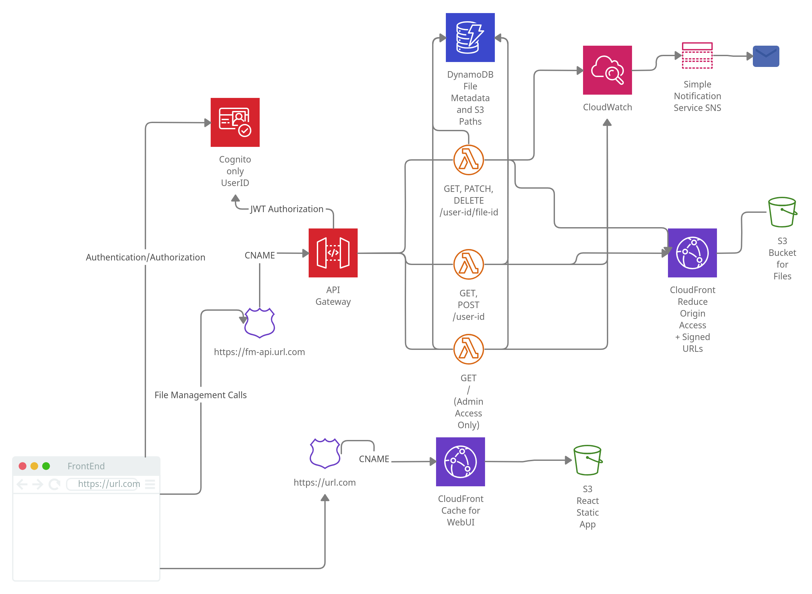

# infrastructure
AWS Resources managed by terraform
## Demo
[Demo Deployment](https://ui.gabrielchencloudfiles.link/)

## Architecture Diagram

## Overall Architecture Notes
The goal of this architecture design is to explore a serverless architecture. All of the infrastructure in the application is fully managed by AWS, using PAAS, and SAAS solutions.

Architecture Breakdown:
1. File Management Service - The file management service is built using 5 key pieces: APIGateway for proxying http requests; AWS Lambda for handling the requests; DynamoDB for managing file information and file metadata; Cloudfront for caching and limiting origin access; and S3 for storing the file uploads. There were also various other peripheral infrastructure, provisioned to support the service including cloudwatch, Route 53, AWS Certificate Manager, AWS Secrets Manager, etc.
2. Front End - The front end is a static (no server-side) React application hosted in S3, distributed using Cloudfront as well for caching, and limiting s3 origin access.
3. User Authentication and Access Control - Cognito, authorization, amplify...

Considerations:
- S3 is a multi-AZ default deployment, with policies for moving to different payment tiers to save money over time.
- DynamoDB is also a multi-AZ deployment for increasing availability
- The Lambdas are serverless, so they rely on AWS's availability claims, not including bugs in the code themselves. They are currently also only deployed in 1 region, us-west-2, but could be deployed in multiple regions by altering the serverless.yml and potentially using environment variables or configurations for deploying to different regions.
- front end is currently deployed using the aws cli, through aws s3 upload and cloudfront invalidations to speed up the propogation of updates for the purpose of development time (see deploy.sh found in the /ui repository).
- Mostly things are managed by AWS, so they rely on AWS's availability guaranteeds, self committed bugs not withstanding. The overall architecture is meant to be modular/microservice esque, so outtages caused by single component failure should be mitigated.
- the S3 buckets don't contain the original file information, including the file name. Instead the file names are reassigned to random UUIDs generated by the lambda, and recorded in the dynamoDB. Users access their files by clicking on the file name, the application correlates it to the unique id on its own. This way, if the s3 bucket is compromised, and the user can list items but not get items, all they see are ids that are not associated with any users, and the contents are invisible.

## Which Resources Managed Here?
As many resources could reasonably be managed here. Part of the File Management Service infrastructure is written in infrastructure as code here in this repository. Terraform was chosen because of it's stateful representation of cloud resources, which is very useful for understanding what resources are currently provisioned. The UI is also managed using the same terraform file. The Lambdas for the File Management Service are provisioned and managed using Serverless Framework.

### File Management
The file management API is built as
S3 Buckets, Cloudfront Distributions,, SNS.

### Improvements In Overall Project, and In This Particular Repo
- If time permitted, the code quality could really be improved.
- Better file structure (terraform modules)
- More interactive UI
- MULTI-AZ/DR/Availability
  - lambdas could be deployed in multiple regions to improve availability, and edge performance. not doing it because short on time, but it can be done!
- ANNOYING WORKAROUND/HACK
  - Currently the ui and the file management service are coupled in a way that I don't like. Unfortunately, because of the runtime I chose for the lambdas, there are certain libraries that are not particularly accessible when working with lambdas. The lambdas don't seem to have an easy way to handle file downloads in multipart/form-data encoding. Therefore the lambdas don't directly write to S3 or cloudfront, instead they return a signed url to the application, where the application can upload at the url. The intention was for this to be automatically rerouted, returning a 3xx statuscode to the application, and letting the browser handle it, but unfortunately, the script based requests in browser get handed off to some under the hood code when the request is rerouted. This breaks CORS, which causes the redirects to fail. I'm not too sure how to fix it, and it's been a wall I've been running into for about a week, so I worked around it by returning the url in json, and having the ui application uploading the file in a callback after making the initial delete request. Not ideal but it works for now. It seems like other runtimes might have a better time with multipart form data, but also API Gateway's proxy integrations do seem to be difficult to configure to enable different types of media.
  - I suppose one thing I learned is that serverless has it's quirks still, and isn't as convenient as advertised.
- file renaming
  - the files are renamed in s3 and do not have file extensions. Ideally, the application is able to rename the files when they're downloaded and reappend the file extension, but as it is it demonstrates the key point, with this mild flaw. most pcs can see the files anyways.
